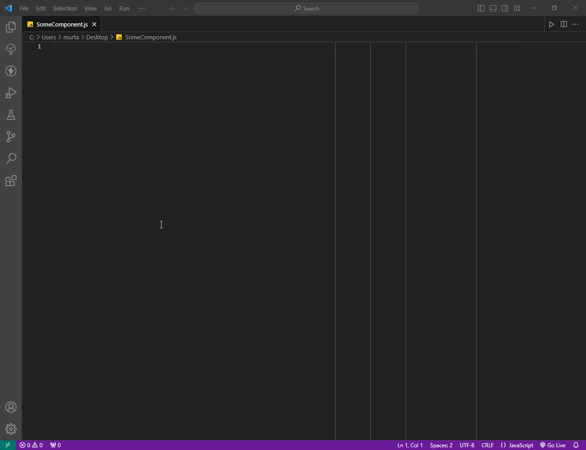

# A Simple Guide to Framework

- [What is Framework?](#what-is-framework)
- [Initial Setup](#initial-setup)
- [Setup Routes](#setup-routes)
- [Creating custom pages and components](#creating-custom-pages-and-components)
- [Attributes](#attributes)
- [Event Listeners](#event-listeners)
- [Refs](#refs)
- [ChildrenHTML](#childrenhtml)
- [Interactivity through local state](#interactivity-through-local-state)
- [Interactivity through global client state](#interactivity-through-global-client-state)
- [Interactivity through global server state](#interactivity-through-global-server-state)
- [The Router](#the-router)
- [Code Snippets](#code-snippets)
- [VSCode Extensions](#vscode-extensions)
- [Example](#example)
- [Final Remarks](#final-remarks)

<br>

#### What is Framework?
Framework is a fairly simple mini-framework that will handle routing, state management and component rendering for us.

For the most part, I think our combined skills lie in HTML, CSS, vanilla JavaScript, and Object Oriented Programming (OOP), which we learnt in our Java lessons. Therefore I designed this framework to match as closely to this skillset as possible, whilst still providing enough scability that we can build a whole chat application relatively quickly, without faffing around with a bunch of event listeners, unmanaged html in javascript files, etc.

There are 3 major components to this mini-framework:
- **Components:** Components combine related javascript and html together. This allows us to break up our files into small, manageable components, whilst allowing us to easily to hook up javascript to our html. Components will contain both html and javascript. Framework follows a reactive state model. This means that we forget about manually updating the DOM, and instead we simply change data, and then trust that the framework will automatically update the DOM based upon our data.
- **State Management:** Framework provides various ways to manage local stage, global client state, and server state (which includes synchronisation between data on the frontend with the backend server).
- **Routing:** Framework provides custom client-side routing. This will allow us to efficiently navigate between pages whilst being able to keep state on the client. More details on routing will be provided below.

There may be quite a bit of detail below. I tried to make it as concise as possible. Please do read the entire thing. Don't stress about anything if it doesn't make sense. Just start using it, and you will start to understand how it works. Getting your hands dirty is the best way to learn.

<br>

#### Initial Setup
We need to set up the router to allow for client side navigation, any associated pages and components, and any global state
```javascript
// main.js
import { stateManager, createComponents, createRouter, html } from 'framework';

// let the application state manager know about your custom state slices
stateManager.createSlices({
  // add custom slices here
});

// let the application know about your custom pages and components
createComponents({
  // add custom components here
});

// let the application router know about what routes and pages you would like to setup
const router = createRouter({
  root: document.querySelector("#root"),
  routes: [
    // add custom routes here
  ]
});
```

<br>

#### Setup Routes
Lets say we want a single route `/`, and we want to render the `<main-page />` component at `/`
```javascript
// main.js

...

const router = createRouter({
  root: document.querySelector("#root"),
  routes: [
    { path: "/", html: html`<main-page />` }
  ]
});
```
Adding ```{ path: "/", html: html`<main-page />` }``` above tells the application router that when we nagivate to `https://www.our-website.com/` then render the `<main-page />` component.

<br>

#### Creating custom pages and components
However, we still haven't created our `<main-page />` component. So let's do that.

```javascript
// MainPage.js
import { BaseComponent, html } from 'framework';

export class MainPage extends BaseComponent {
  constructor() {
    super();
  }

  // <main-page /> will render the following html
  render() {
    return html`
      <div class="some-classes-for-styling">
        <x-counter />
      </div>
    `;
  }
}
```

Now that we've created the `MainPage` component, we need to let the application know about it.
```javascript
// main.js
import { MainPage } from "./MainPage"

...

createComponents({
  "main-page": MainPage
});
```
The above code will associate `<main-page />` with the MainPage component.

The name of components must have atleast 2 words, separated by a dash (-). If your component is a single word, then adding something like an "x-" prefix would be fine. For example, if your component is called `Counter`, then when registering the component with the application, you should call it `x-counter`

<br>

If you saw above, we used an `<x-counter />` component inside `<main-page />`. So we now need to define this component.
```javascript
// Counter.js
import { BaseComponent, html } from 'framework';

export class Counter extends BaseComponent {
  constructor() {
    super();
  }

  render() {
    return html`
      <div>
        <p>0</p>
        <button>+</button>
      </div>
    `;
  }
}
```
```javascript
// main.js
import { Counter } from "./Counter"

...

createComponents({
  "main-page": MainPage,
  "x-counter": Counter
});
```

<br>

#### Attributes
Lets say we wanted to add an initial value for our counter. We can do this through attributes. But what are attributes?
```html
<x-counter initial="0" />
```
The `initial="0"` is an attribute of `<counter />`.

<br>

Let's see how we can get access to such a property.
```javascript
// Counter.js
import { BaseComponent, html } from 'framework';

export class Counter extends BaseComponent {
  constructor() {
    super();
    this.initialValue = this.attr("initial"); // get "initial" attribute
  }

  render() {
    return html`
      <div>
        <!-- use the "initial" attribute -->
        <p>${this.initialValue}</p>
        <button>+</button>
      </div>
    `;
  }
}
```

However, if we want to do anything to this attribute, such as add 5 to it, then we would like it to be a `number` and not a `string`. All attributes will be `string` by default, and therefore a conversion function must be applied to change its form. 3 premade converters have been made for you already:
  - `string => number`
  - `string => boolean`
  - `string => html`

```javascript
import { BaseComponent, html, converter } from 'framework'; // import converter

export class Counter extends BaseComponent {
  constructor() {
    super();
    this.initialValue = this.attr("initial", converter.number); // convert to number
    this.initialValue = this.initialValue + 5; // make any changes you like
  }

  render() {
    return html`
      <div>
        <p>${this.initialValue}</p>
        <button>+</button>
      </div>
    `;
  }
}
```

You're free to create your own custom converter functions of the form:
```javascript
(attributeValue) => {
  // do whatever logic you want
  return someConvertedValue
}
```

<br>

#### Event Listeners
If you want to add a **click** event listener and handler, then you can do it using:
```html
<button @click=${() => someFunction()}>+</button>
```
Similarly, you can add a **submit** event listener and handler:
```html
<form @submit=${() => someFunction()}></form>
```

For example:
```javascript
// Counter.js
import { BaseComponent, html } from 'framework';

export class Counter extends BaseComponent {
  constructor() {
    super();
  }

  render() {
    return html`
      <div>
        <p>0</p>

        <!-- add a click event listener -->
        <button @click=${() => console.log("this will run when the button is clicked")}>+</button>
      </div>
    `;
  }
}
```

You can attach any event listener that you would normally use with `addEventListener`. The most used event listeners will likely be `@click` and `@submit`, but check out the [MDN documentation on Event Types](https://developer.mozilla.org/en-US/docs/Web/API/Event) to see the full list of event listener types.

<br>

#### Refs
If all you need to do is attach event listeners, then the above method is the most suitable. However what if we wanted full access to the element? We can use refs to gain full access to an element, and then we can do anything we need to with the element (including attaching event listeners, but much more). Here is the above example, but instead adding an event listener through refs:
```javascript
import { BaseComponent, html, converter } from 'framework';

export class Counter extends BaseComponent {
  constructor() {
    super();

    // create ref for button
    this.buttonRef = this.ref();
  }

  render() {
    return html`
      <div>
        <p>0</p>

        <!-- attach a "ref ID" to the button -->
        <button id=${this.buttonRef.id}>+</button>
      </div>
    `;
  }

  // the hydrate method is called after every render,
  // and its purpose is to add event listeners to the html,
  // a process known as hydration
  hydrate() {
    // access the button element via buttonRef.element
    const button = this.buttonRef.element;

    // ... do whatever you like with the button

    // setup a click event listener on the button that calls increment()
    // you must NOT use this.addEventListener()
    // it must be this.addEventListenerToElement()
    this.addEventListenerToElement(button, "click", () => console.log("this will run when the button is clicked"));
  }
}
```

**Refs will often be used for extracting values from user inputs and submitting forms.**

<br>

#### ChildrenHTML
What are children in HTML?
```html
<x-container>
  <p>all elements that go inside here are known as children.</p>
  <element-two />
  <element-three />
  <element-four />
  <element-five />
  ...
</x-container>
```

Let's say we wanted to create a container component that has some default styles and other premade elements, and we want to put all our child elements inside that. Then we can do the following:
```javascript
// Container.js
import { BaseComponent, html, converter } from 'framework';

export class Container extends BaseComponent {
  constructor() {
    super();
  }

  render() {
    return html`
      <div class="classes-for-styling">
        <premade-element-one />
        <premade-element-two />

        <!-- Simply place this.childrenHTML wherever you want them to be rendered -->
        ${this.childrenHTML}

        <premade-element-three />
        <premade-element-four />
      </div>
    `;
  }
}
```

```javascript
// main.js
import { Container } from "./Container"

...

// don't forget to register your component
createComponents({
  "main-page": MainPage,
  "x-counter": Counter,
  "x-container": Container
});
```

The children will now appear inside your container, sandwhiched between the `premade-elements`.

<br>

#### Interactivity through local state
We still need to make our counter interactive. Let's add a way to increment the number when we click a button.
```javascript
import { BaseComponent, html, converter } from 'framework';

export class Counter extends BaseComponent {
  constructor() {
    super();
    this.initialValue = this.attr("initial", converter.number);

    // create some local state,
    // whenever this local state changes,
    // it will force a re-render of the component
    // without us having to manually change the html
    this.counter = this.state(this.initialValue);
  }

  render() {
    return html`
      <div>
        <!-- use the state value instead of the initial value -->
        <p>${this.counter.state}</p>

        <!-- setup a click handler to call the increment() function -->
        <button @click=${() => this.increment()}>+</button>
      </div>
    `;
  }

  // a function that will increment the counter's value,
  // note that we only change the state's value and
  // do NOT have to make manual changes to the DOM
  // in order for the DOM to reflect the state's value
  increment() {
    this.counter.state++;
  }
}
```
Adding local state will manage the html for us. Every time the state's value changes, the DOM will automatically be updated to match the state. Adding a click handler to the button will allow the user to increment the state's value.

**Note: Local state will only exist for the duration of the component. As soon the component has been "unmounted" from the DOM, then the state will be erased. Upon remount, a fresh new state will be created. A component will be "mounted" if it is visible on the DOM, and it is "unmounted" if it is not visible on the DOM.**

<br>

#### Interactivity through global client state
What is the main difference between local state and global state? Global state exists outside components, therefore:
- it can be shared across components
- it exists for the duration of the application (until the user refreshes or reloads), therefore it will not expire or be erased upon component unmounts

Since it exists outside a component, we need to create a custom state "slice" outside the component in the main application.
```javascript
// CounterSlice.js
import { StateSlice } from 'framework';

export class CounterSlice extends StateSlice {
  constructor() {
    // create some initial state
    const initialState = {
      value: 0
    };

    // pass the initial state into super()
    super(initialState);
  }

  // create custom "actions" to interact with this state
  increment() {
    this.state.value++;
  }
}
```

We need to let the application know about our new state slice.
```javascript
// main.js
import { CounterSlice } from "./CounterSlice"

...

// give the counter slice a name, and associate it with the CounterSlice class
stateManager.createSlices({
  "counter": CounterSlice
});
```

Let's see how we can access this global CounterSlice in our component.
```javascript
import { BaseComponent, html, converter } from 'framework';

export class Counter extends BaseComponent {
  constructor() {
    super();

    // use the name you assigned it above
    this.counter = this.slice("counter");
  }

  render() {
    return html`
      <div>
        <!-- use your global state -->
        <p>${this.counter.state.value}</p>

        <!-- use the custom "actions" you created inside your state slice -->
        <button @click=${() => this.counter.actions.increment()}>+</button>
      </div>
    `;
  }
}
```
Since this is using global state, you can:
- navigate to another page and come back and it will still be there
- consume and change this state in another component and have it be updated everywhere


<br>

#### Interactivity through global server state
In most applications, you will likely need to interact with a backend server. The problem with this is that it takes time to send and receive data to and from the server. Server state allows for asynchronous state management, allowing for caching and other utilities to help manage the complexity associated with interacting with servers.

Lets create 2 functions, one for **getting** the counter value from the server, and another for **updating** the counter value on the server. Retrieving data will be known as a **Query** and sending/updating data to the server will be known as a **Mutation**.
```javascript
// counterServerActions.js

export const counterQuery = () => ({
  queryFn: () => api.get("/counter").json(),
  tag: "counter"
});

export const counterIncrementMutation = () => ({
  mutationFn: (data) => api.put("/counter", { json: data }).json(),
  invalidateTags: ["counter"],
});
```

We will talk about `tags` and `invalidateTags` later, for now let's use these functions in our component.
```javascript
import { BaseComponent, html, converter } from 'framework';

// import the query and mutation functions
import { counterQuery, counterIncrementMutation } from "./counterServerActions";

export class Counter extends BaseComponent {
  constructor() {
    super();

    // this will hold our counter state (retrieved from the server)
    this.counter = this.query(counterQuery());

    // this will hold a function that will let us update the data on the server
    this.counterIncrement = this.mutation(counterIncrementMutation());
  }

  render() {
    return html`
      <div>
        <!-- use your server state query -->
        <p>${this.counter.state.data}</p>

        <!-- use the mutate() function that exists on the mutation -->
        <!-- the "1" that is passed in is the amount by how much you want to increment,
        and this will be pased the mutationFn defined above -->
        <button @click=${() => this.counterIncrement.actions.mutate(1)}>+</button>
      </div>
    `;
  }
}
```
However, at the start, there is going to be brief moment where we do not have any data because our application hasn't fetched it from the server. Therefore, accessing data at `<p>${this.counter.state.data}</p>` will throw an error, since the data hasn't arrived yet. So what do we do?

There are additional properties that we can use.
- `this.counter.state.status` - this will either be `loading` (i.e. we have no data), `success` (i.e. we now have data), or `error` (i.e. an error occurred during fetching)
- `this.counter.state.error` - if an error occurred, the error can be retrieved from here

Using these properties, we can do something like the following:
```javascript
import { BaseComponent, html, converter } from 'framework';

// import the query and mutation functions
import { counterQuery, counterIncrementMutation } from "./counterServerActions";

export class Counter extends BaseComponent {
  constructor() {
    super();
    this.counter = this.query(counterQuery());
    this.counterIncrement = this.mutation(counterIncrementMutation());
  }

  render() {
    // if it's loading, then render some loading html
    if (this.counter.state.status === "loading") {
      return html`<p>Loading...</p>`;
    }

    // if an error occurred, then render some error html
    if (this.counter.state.status === "error") {
      return html`<p>Error...</p>`;
    }

    // if it's not loading and there is no error, then render our normal html,
    // since at this point, we can be sure we have data and no error has occurred
    return html`
      <div>
        <p>${this.counter.state.data}</p>
        <button @click=${() => this.counterIncrement.actions.mutate(1)}>+</button>
      </div>
    `;
  }
}
```

<br>

**What are `tags` and `invalidateTags`?**
In order to understand this, you must first remember that:
- a `query` is only responsible for retrieval of data from the server, it does not update any data
- a `mutation` is only responsible for updating data, it does not retrieve data (for the purposes of rendering)

When we send a `mutation` to update the counter value on the server, the counter `query` does not realise that the data it has is now stale (i.e. it no longer matches the data on the server). Therefore, we attach a `tag` to the query to identify it. Then on a mutation, we set an `invalidateTags`. Whenever the mutation runs, it invalidates the `query` tags listed in its `invalidateTags`, and therefore the query knows that its data is now stale, therefore it must refetch the data from the server and update the DOM. Without this `invalidateTags`, the `query` will not refetch its data, and therefore the DOM will not update.

<br>

#### The Router
When using normal `.html` files, `<a></a>` tags use server-side routing. If the application has to manage state, then the server would be responsible for managing it and keeping it persistent across page refreshes. However, in our architecture, the backend and frontend are completely independent, with the only interaction being through an API interface. This means that the job of managing state falls onto the client itself. Server-side routing always refreshes the page/application, which means we would lose all client state. Therefore we need to move away from server-side routing to client-side routing. A number of tools have been made to make client-side routing possible. Without them, our global state would not persist across page nagivations.

<br>

**`createRouter`**
Create a Router instance that will manage which pages to render at which URLs.

<br>

**`<x-link href="/some-url"></x-link>`**
`<x-link />` **must** be used instead of the `<a href="/some-url"></a>` to allow for client-side navigation, since `<a href="/some-url"></a>` uses server-side routing by default. `<x-link />` uses the `<a></a>` tag underneath, but changes its behaviour to suit client-side routing.

<br>

**`<x-navigate href="/some-url"></x-navigate>`**
This is essentially used for automatic redirects. Useful in instances where an error has occurred and you want to redirect the user to another page. When using server state (i.e. queries and mutations), then it is a simple case of using `if (this.stateName.state.status === "error")` and then rendering an `<x-navigate />` if its true.

<br>

**`history`**
The history API can be used to access data about the URL, or programatically navigate to other pages.
```javascript
// first, import history
import { history } from "framework"

// Data on the current location. Includes the following:
// `key`: A unique string associated with this location. May be used to safely store and retrieve data in some other storage API, like localStorage.
// `pathname`: A URL pathname, beginning with a /
// `params`: some number of `:param` identified on routes during router setup
// `state`: A value of arbitrary data associated with this location
// `search`: A URL search string, the one that begins with ?
// `hash`: A URL fragment identifier, beginning with a #
console.log(history.data.key);
console.log(history.data.pathname);
console.log(history.data.params);
console.log(history.data.state);
console.log(history.data.search);
console.log(history.data.hash);

// navigate to another page
history.push("/some-url");

// navigate to another page, but do not remember the current page when pressing `back` on the browser
history.replace("/some-url");

// go 1 step forwards
history.forward();

// go 1 step backwards
history.back();

// go forwards or backwards
history.go(2); // go 2 step forward
history.go(-2); // go 2 step backwards
```

<br>

#### Code Snippets
A snippet allows you to generate a bunch of code by just writing a few letters, for example:


I have created a number of snippets (for components, state slices, querys and mutations) to help with the boilerplate. You can find them **[here](./snippets/framework.code-snippets)**.

We can change these snippets as needed later. Let me know if you want help to set them up.

<br>

#### VSCode Extensions
There are a number of extensions that will make your life easier when using VSCode:

1. [HTML CSS Support](https://marketplace.visualstudio.com/items?itemName=ecmel.vscode-html-css): additional QoL features for HTML and CSS
2. [Auto Rename Tag](https://marketplace.visualstudio.com/items?itemName=formulahendry.auto-rename-tag): When renaming a tag, this will automatically rename the other end of the tag
3. [lit-html](https://marketplace.visualstudio.com/items?itemName=bierner.lit-html): HTML syntax highlighting in JavaScript
4. [vscode-styled-components](https://marketplace.visualstudio.com/items?itemName=styled-components.vscode-styled-components): CSS syntax highlighting in JavaScript
5. [ESLint](https://marketplace.visualstudio.com/items?itemName=dbaeumer.vscode-eslint): Checks your code for syntax errors and other things based upon a config file, leading to more clean and robust code

<br>

#### Example
I've created an example application that uses Framework. Have a look at it [here](https://github.com/murtaza135/framework-counter).

<br>

#### Final Remarks
I have done my best to make this mini-framework as general and scalable as possible, whilst still being as easy as possible to use, however, there could still be a number of problems:
- people will need to read the documentation as they are unfamiliar with it, therefore there is still a lot of places where confusion could arise
- since this framework has not been battle tested, there could very well be a number of bugs in it
- there could be a number of performance concerns, despite my effort to mitigate them as best as possible
- we will likely need to implement websockets for the chat portion and file collaboration portion of the application, which I've never used, so the architecture of this framework may not work well with websockets

There is definitely a chance that things could go horribly wrong, but I think that's a risk we should take, especially once you understand how it works, it becomes very easy to quickly build components and features.

It should, however, be considerably more scalable than randomly putting code into different files (or one big one for that matter), since this mini-framework brings a a particular way of doing things, making it more consistent to work with the application code.

I have also used TypeScript to make Framework. This means that you will get plenty of type hints and autocomplete to help you.

Let's hope you enjoy working with it.
