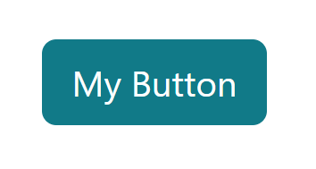

# Styling

## Bootstrap
Bootstrap is a CSS framework that contains a whole bunch of premade CSS classes. The idea is that we take these css classes and simply drop them into our html, and our html will be styled for us. This is amazing if you do not feel very comfortable with css and styling in general.

Here is an example:
```html
<button class="btn btn-primary btn-lg">My Button</button>
```


I wrote no CSS at all. Its all already written for us by bootstrap. `btn` sets base styling on the button, `btn-primary` gives it our nice background colour, and `btn-lg` makes it a little larger than a regular button.

Go to the [bootstrap website](https://getbootstrap.com/) and check out their documentation. If you need anything, just write it in their search bar at the top, and you'll probably find something.

<br>

##### Bootstrap Preconfigured
I have already configured our primary colour to be the nice teal colour you see above. So whenever you use classes like `bg-primary`, `text-primary`, etc, then the teal colour will be used.

For the remainder of the colours that you can use, check out the bootstrap documentation [here](https://getbootstrap.com/docs/5.3/utilities/colors).

<br>

## Custom Styling
Whilst bootstrap can takes us quite far, it can't do everything. We will have to write custom styling for some parts of our application.

I have created a file at `@/styles/main.css`. We can put all of our custom styling in this file.
